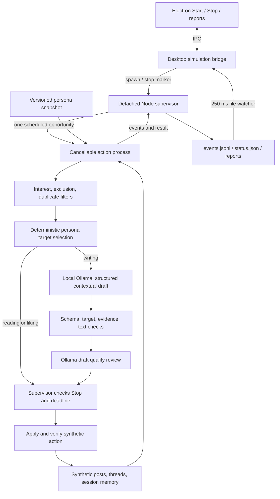

# Contextual simulation architecture

The controller now starts a synthetic session driven by local Ollama. It does not operate the phone or publish to X. The Android supervisor, VPS relay, ADB routes and existing X workflow remain separate subsystems.

## Session lifecycle

`scripts/simulation.mjs` owns a detached hidden supervisor, one action process at a time, an exclusive synthetic session lease, an idempotent Start command, deadlines, a ten-second heartbeat and final cleanup. Closing the controller does not end the session. Stop writes a marker; the supervisor checks it every 50 ms, cancels the worker and aborts any model HTTP request. A worker that does not exit is killed after about one second. A permit is required immediately before each simulated mutation. A mutation already permitted can complete; its verified or uncertain result remains in the report. The worker waits for the supervisor to acknowledge its final result before disconnecting, preventing lost-result shutdown races. Errors stop the session without automatic replay.

The preset schedules view, like, comment, read comments, reply, create post and scroll in that order, three cycles by default. This is a test schedule, not a claim of realistic human behavior. An opportunity is skipped when the persona rules find no eligible target. Persona rules rank eligible targets by unseen status, interest and stable ID. Ollama writes the contribution for the selected target; neither chooses the action schedule. A session ends on sequence completion, duration limit, Stop or failure.

## Persona and context

`config/personas/practical-tech.json` defines fictional Alex's interests, hard exclusions, minimum engagement scores and voice. The complete validated persona is frozen in each session's config. Deterministic code removes excluded or low-interest candidates, duplicate likes/comments/replies, and replies outside the selected post's thread.

`scripts/contextual-brain.mjs` sends only the action, persona description/voice/interests, eligible synthetic posts with concrete prototype details or comments, the relevant thread, and summaries of up to twelve prior verified interactions. Generation receives action/target IDs and covered-word summaries instead of verbatim previous drafts, reducing copying. Local duplicate validation and the quality reviewer use the actual prior text. Post generation draws on seen eligible posts. The selected target and its source quotations are fixed in the writing response schema. The model supplies fresh text and a short justification, with distinct contribution styles for questions, direct answers and standalone observations; it cannot silently change targets or convert an eligible writing step into a skip. Runtime validation checks the result again. Viewing, liking, reading comments and scrolling use persona rules without model calls. Writing is limited to 280 characters and checked for invalid content, unsupported personal claims and near-duplicate recent wording.

For writing actions, a second model call reviews relevance, grounding and repetition. The evidence reviewer returns pass/reject and a defect category. Repetition rejection requires a prior contribution ID, exact quotes from that contribution and the draft, and an explanation of the shared idea. Prior contributions are numbered separately from target IDs. Shared subject matter alone is not repetition; paraphrased advice and questions already answered in the thread are. Local text-similarity checks remain unchanged.

Invalid schema, missing/invented quotation evidence, inconsistent verdict fields and recognized explicit contradictions produce a `review_invalid` event. One bounded review retry uses the unchanged draft/context; no new draft is generated. A second invalid review ends the session as `INVALID_REVIEW`, categorized as `reviewer_failure` separately from rejected drafts. A valid rejection is final with no retry. HTTP errors, timeouts and cancellation are not retried. The existing action deadline bounds the additional call. Reports retain both invalid attempts and valid verdict evidence. Text checks catch known explicit contradictions, not every possible semantic inconsistency; model reviews can still miss defects or reject good drafts. No template fallback or automatic submission replay occurs.

Memory is local to the session and bounded to twelve verified interactions. A new session starts a fresh synthetic fixture; there is no cross-session personal memory, retrieval database or live feed reader yet. Templates remain only for explicitly selected deterministic regression tests, and are excluded from model prompts.

## Model boundary and configuration

The simulation adapter uses Ollama `/api/show` to verify a local model and `/api/chat` with JSON-schema output and `stream: false`. Planning and quality review use non-thinking mode by default. Programmatic `brain.think` can enable thinking for planning, but the tested Qwen3.5 thinking run exhausted its output budget; this mode is experimental. Internal thinking text is not recorded; only the structured decision and high-level reason enter reports. Loopback HTTP only; cloud model tags and remote-backed aliases are rejected. Model selection precedence is explicit programmatic `brain` options, inherited `OLLAMA_MODEL`/`OLLAMA_BASE_URL`, the same two keys in repository `.env`, then `qwen3.5:9b` at `http://127.0.0.1:11434`. Other `.env` keys are not loaded into simulation reports or prompts.

Planning has a bounded token budget (2,048 with thinking, 800 otherwise); review has an 800-token budget. Model calls have a 60-second timeout each; an action normally has 130 seconds for planning, optional review and execution. The default overall session limit remains five minutes. Changing a model tag affects the next session without changing the supervisor or controller. Models differ in structured-output and thinking support; the local smoke accepts `--model <installed-tag>` for comparisons. A future provider implements the same decision contract. The older TypeScript `src/brain/ollama.ts` X-draft planner is still separate.

Official API references: [Chat API](https://docs.ollama.com/api/chat), [structured outputs](https://docs.ollama.com/capabilities/structured-outputs).

## Controller updates and session evidence

The worker sends phase, decision, proposed draft, review and result messages over Node IPC. The supervisor appends sequenced events and atomically updates status. `desktop/simulation.cjs` watches status every 250 ms and forwards new events through Electron IPC/preload to the renderer. The display retains 200 recent events; the on-disk journal retains the session trace. These are lifecycle/model-call updates, not streamed model tokens, and do not travel through the VPS or phone relay.

Each session has `results/automation/<run-id>/config.json`, `status.json`, `events.jsonl`, final `report.json` and `report.md`. Reports include model/prompt version, persona, processed/skipped counts, model requests/responses/latency/token totals, errors, stop latency and decision/review history. JSON contains the full event trace. Live submissions are explicitly zero. The controller's Refresh sessions / Load session report retrieves any of the 50 most recent sessions; older reports remain on disk. Abrupt supervisor death is reconciled as interrupted when status is read after a stale heartbeat, with cleanup marked unconfirmed.

## Repeatable checks

- `npm.cmd run test:contextual:review`: evidence validation, bounded retry, unchanged context, final rejection and cancellation regression cases.
- `npm.cmd run eval:contextual:review`: installed local model evaluation on agent-labeled synthetic examples, including a saved hour-run failure. Writes `results/contextual-review-eval.json` with false acceptance/rejection counts and reviewer failures. This small development set is not an independent benchmark or evidence of Chrome/X readiness.

Run regression suites serially while no manual session is running:

- `npm.cmd run test:contextual`: bounded local HTTP fixtures, schema/target/evidence/repetition checks, quality rejection, timeout, real in-flight cancellation, memory and reports.
- `npm.cmd run test:simulation`: deterministic process lifecycle tests, including crash recovery.
- `npm.cmd run test:simulation:ui`: headless controller integration, Start/Stop/reopen/error/report/history.
- `npm.cmd run test:contextual:local`: detached one-cycle smoke against installed Ollama. Inspect `results/contextual-live.json` later. It stops and reports automatically, within a bounded duration.
- `npm.cmd run test:simulation:batch`: detached deterministic lifecycle repetitions. These do not measure model quality.

The installed-model smoke requires a completed cycle and generated comment, reply and standalone post. An installed-model smoke is evidence of that run, not an error-rate guarantee.

## Varied contextual batch

`scripts/contextual-batch.mjs` runs detached, serial sessions using versioned presets in `scripts/contextual-fixtures.mjs`: garden automation, local note classification, Android telemetry, repairable hardware, classroom science, an existing thread answer, excluded content and an empty feed. Each quality session requests two seven-action cycles; single-topic fixtures deliberately exercise duplicate engagement skips on the second cycle. Science falls below the comment/reply thresholds. Excluded and empty fixtures exercise entirely valid skips. The initial fixture and persona are frozen in each session config.

An initial separate session requests Stop while a local model call is outstanding. It must stop within two seconds, clean up, and show no submissions after the accepted Stop event. Existing HTTP regression tests additionally verify that cancellation closes the HTTP connection; a real-model Stop report does not prove when the server stopped GPU computation.

Aggregate JSON includes full/partial cycle counts, skips checked by replaying verified actions against frozen eligibility inputs, verified writing categories, draft rejection categories and reviewer reasons, within-session and cross-session text similarity counts, and model response latency median/p95/max plus token/request totals. Failed or cancelled requests are excluded from response latency statistics; session elapsed time remains recorded. Cross-session similarity is observational because memory resets per session. Proposed drafts, including validation failures, remain in per-session traces. No automatic retry, fallback, live operation or prompt tuning occurs in the batch.

See the runbook for launch, smoke gating, cancellation and crash-recovery boundaries. Focused runner checks use a local HTTP fixture and real detached session processes; only installed-model batch reports measure actual model behavior.
